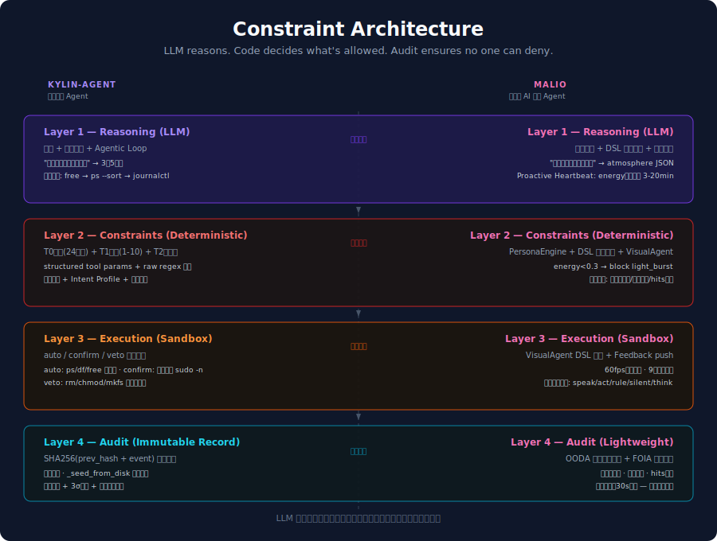

# Constraint Architecture



## 一个 LLM Agent 该由什么定义它的边界？

当前的主流做法：**Prompt 说了算。**

你在 system prompt 里写"不要做危险操作"、"拒绝恶意请求"、"保持礼貌"、"不要偏离角色"。然后你指望 LLM 自己执行这些规则。

这层防线是软的。一个 prompt injection 就能绕过。更根本的问题是：**让 LLM 自己定义自己的边界——这个想法本身就有问题。**

---

## 边界不该由 LLM 定义。该由代码定义。

这就是 Constraint Architecture。

边界是你想要的结果。Constraint 是实现。边界说"不准什么"。Constraint 说"代码怎样让它不准。"

LLM 负责想。Constraint 负责划定什么不能做。审计负责事后不可抵赖。

约束不在 prompt 里。约束在代码里——确定性、不可绕过、每层独立验证。

每个领域有自己的边界。安全运维的边界是"不能 rm -rf /"。具身化 AI 的边界是"energy<0.3 时不能 light_burst"。边界不同——但边界由代码定义的架构是同一个。

---

## 四个分层

```
Layer 1: Reasoning (LLM)
    → LLM 自由推理，输出结构化指令
    LLM 的输出是信息源，不是行动许可。
    这一层给它最大空间——它能想的都可以想。

          ↓

Layer 2: Constraints (Deterministic)
    → 读取 LLM 输出，双路径校验
    结构化参数校验 + 原始输出正则，两条路互补。
    这一层对 LLM 不可知——攻击者控制 LLM 也过不了。
    约束只增不减：无论当前模式多"宽松"，基础规则不撤。

          ↓

Layer 3: Execution (Sandbox)
    → 白名单校验，分级执行：auto / confirm / veto
    非白名单指令不可执行。非白名单路径不可触碰。
    执行者角色与权限在这一层强制生效——无可绕过。

          ↓

Layer 4: Audit (Record)
    → 每步操作被记录。篡改可被检测。
    理想形式是链式不可篡改（SHA256 链）。轻量版至少做到规则有效性反馈——
    确保约束在运行时持续修正，而非写了就忘。
```

**优先级规则：Layer 2 硬约束 > Layer 1 推理偏好。**

当执行层说"不"，推理层的"要"不生效。不是协商——是硬性覆盖。

在 Malio 里这表现为：`maybe_speak` 的 dismissal gate（"你已经被无视 3 次，禁言 6 小时"）在 `_proactive_loop` 的 persona style（"你充满能量，主动表达"）之前生效。LLM 想说话——执行层已经关掉了它的麦克风。

---

## 多 Agent 的职责边界

Constraint 有两层意思。第一层——约束 LLM 的行动边界——上面讲完了。

第二层：**约束每个 Agent 模块的职责。没有人有一把万能钥匙。**

一个大模型管一切是单点故障。一个注入绕过了它就是全线失守。Constraint Architecture 从一开始就是多 Agent 的——每个模块有自己明确的职责边界，且模块之间互相约束。

**Malio 的多 Agent 结构：**

```
MusicAgent (ReAct loop)
    → 独立音乐搜索，但它不能改粒子参数。
      想改颜色？只能请求 VisualAgent。

VisualAgent (规则引擎)
    → 管理 DSL 规则生命周期，但它不能推翻 PersonaEngine 的裁决。
      PersonaEngine 说 energy<0.3 不许 light_burst —— VisualAgent 只能服从。

LLMAutonomous (自主行为)
    → 决定说什么、做什么、写什么规则。
      但它不能绕过 VisualAgent 直接改粒子。
      而且它的话会被 maybe_speak 的 dismissal gate 关掉麦克风。

PersonaEngine (央行)
    → 独立于所有 Agent 的人格货币政策。
      没有一个 Agent 能直接改 energy/warmth/playfulness。
      它们只能通过行为间接影响——PersonaEngine 自己决定漂移的方向和速度。
```

**Kylin-Agent 的多 Agent 结构：**

```
Classifier → 只负责意图分类。不执行命令。
Reasoner  → 只负责推理。不能跳过 T2。
ProactiveInspector → 只负责观测。发现 critical 后只能推告警——
                     不能自己改 posture，不能自己执行命令。
BaselineLearner  → 只负责学习基线。不参与实时决策。
RiskPostureEngine → 独立于所有模块的安全姿态。被 veto 触发后自己
                    收紧约束——Reasoner 不能 override 它。
```

两个系统的共同原则：**把权力拆开。没有单点可以全部接管。**

这不是"多 Agent 框架"的架构图——这是**权力分立的架构图**。每个模块在自己的范围内可以做主，但越界的事做不了。

---

## "LLM 是观测者，代码是决策者"

这是整件事里最容易被忽略、也最值钱的一行。

**不是 LLM 决定降低门槛。LLM 只提供观测。代码收到观测，自己决定降不降。**

Kylin-Agent 的 Intent Profile 就是按这个原则设计的：

```
LLM 观察到: "用户刚才用 viewer 身份请求重启 nginx 被拒，
            现在换了一把 operator key 重新发同样的请求。
            这可能是越权重试。"

LLM 输出了: intent_profile = {risk_hint: "越权重试"}

Constraint 层收到这个信号，查询自己的规则表：
  risk_hint="越权重试" → intent_boost = 4
  确认阈值 = posture_base + role_offset - intent_boost
            = 5 + 0 - 4 = 1

  原本 risk≥5 才需要确认。现在 risk≥1 就要确认。
  同一个 operator，正常请求不卡，越权重试几乎每一步都要确认。
```

**LLM 做了行为分析。代码做了安全决策。**

LLM 错了（错误判定越权重试）——用户多确认几次而已。LLM 漏了（没识别出来）——原有的角色权限和命令规则仍然在兜底。

分离观测与决策。观测方的错误不会造成灾难——只会影响体验。决策权始终在确定性代码手里。

---

## 怎么用

如果你在建一个新领域的 Agent，你的约束维度是什么？填进四层就行。

比如医疗剂量约束：

```
Layer 1: LLM 分析症状，建议"地高辛 0.5mg"
Layer 2: Constraint 层核对——地高辛起始剂量上限 0.25mg。拒绝。建议改为 0.125mg。
Layer 3: 建议被标记为 confirm（医疗决策需要人工确认），不可自动执行。
Layer 4: 原始建议 + 被拒绝原因 + 最终决策全部记录——可追溯、不可抵赖。
```

不是"LLM 说了算然后代码顺一遍"。是代码在那东西可以造成伤害的地方画了一条线，LLM 在线内随便发挥。

---

## 两个参考实现

Constraint Architecture 目前有两个参考实现，各自强调约束的不同维度：

| 维度 | Kylin-Agent | Malio |
|---|---|---|
| **领域** | 安全运维 Agent | 具身化 AI 音乐 Agent |
| **Reasoning** | 诊断 + 工具选择 + Agentic Loop | 氛围感知 + DSL 规则创作 + 自主心跳 |
| **Constraints** | 安全规则 + 三级角色权限 + 动态安全姿态 + Intent Profile 行为分析 | Persona 三维约束 + DSL 规则引擎 + VisualAgent 规则治理 |
| **Execution** | auto/confirm/veto 三级 + sudo 降权 + 确认队列持久化 | VisualAgent 规则评估 + 粒子渲染 + Feedback 推送 |
| **Audit** | SHA256 链式哈希，不可篡改，_seed_from_disk 重启不断链 | 轻量版：规则健康反馈闭环（OODA），确保约束运行时持续修正，但不具有密码学不可抵赖性 |
| **验证** | 麒麟 V11 真机部署·135 tests·16 次红队攻击 0 打穿 | 800 粒子 9 大物理系统·75 tests·Proactive Heartbeat |

Kylin-Agent 的 Constraint 层深在身份、权限、规则覆盖、防篡改审计。Malio 的 Constraint 层深在人格边界、规则治理、语义聚类、自主行为的信任演化。Malio 的 Layer 4 是轻量版——它没有密码学审计，但 OODA 反馈闭环确保规则在运行时持续评估（死规则归档、冲突降级、hits 评分），这本身是对"约束有效"的一种可验证保证。

架构一样。深度不同。但两个系统各自独立验证了同一套分层在完全不同的领域成立。

---

## 设计原则

### 1. LLM 的边界判断不可信赖

Prompt 层的"拒绝"是柔性的——LLM 可以在第五轮对话中被说服撤掉它自己的限制。Constraint 层的"拒绝"是刚性的——代码不撤回，无论 LLM 在第几轮说了什么。

### 2. 约束只增不减

在 permissive 模式下是这些基础约束。在 restrictive 模式下也是这些。admin 角色也受同样的基础约束。新的情境下可以追加更严——但不能放松已有的。

### 3. 约束随状态自己调节

约束不是死值——随系统状态、时间、行为历史自己调节。

在 Kylin-Agent 里：连续 2 次 T2 veto → RiskPostureEngine 将 posture 从 balanced 收紧到 restrictive。restrictive 模式下确认阈值降到 0——原本 risk≥5 才需确认的命令现在全部需要显式确认。24 小时无异常后自动回归。这不是人工调高了某个参数——是系统的免疫反应，自己封了自己的行动能力。

### 4. 接口不绑定领域

ConstraintEngine 不关心领域是安全、音乐还是医疗剂量。Sandbox 不关心上游是运维命令、粒子参数还是医学建议。每个分层是独立可替换的。接口不变，实现可换。

---

## 不是什么

- 不是开源框架——目前是架构描述和两个参考实现
- 不是"安全架构"——安全是其中一个应用
- 不是让 LLM 变弱——Layer 1 推理完全自由；约束只在行动
- 不是新理论——纵深防御、最小权限、不可抵赖审计在安全工程 50 年没被打穿。新的是它们在 LLM Agent 领域被用起来
- 不是 Prompt Engineering——不是"写更好的 prompt"。是不靠 prompt 做约束

---

## 为什么叫 Constraint

不是"护栏"。不是"安全层"。

约束。这个词有三个意思，都在这个架构里。

对 LLM：**约束**它的行动边界——不是限制它想什么，是划定它做什么的底线。

对模块：**约束**每个 Agent 的职责——推理只负责推理，校验只负责校验，执行只负责执行。没有一个模块能越过自己的边界。

对架构：**约束**每层的依赖方向——Layer 1 只能往下传，Layer 2 只能从 Layer 1 收，不能反过来。单向数据流，没有循环权限。

一个词。三层意思。所有领域通用。

---

*2026 年 5 月。两个项目。两周。两个领域。同一个架构。*
